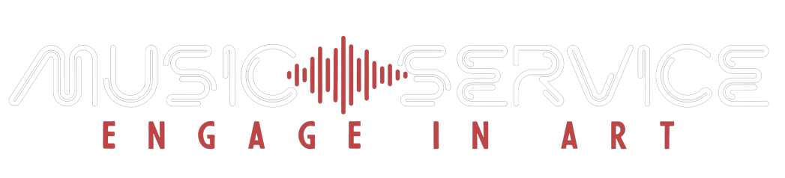

<a id="readme-top"></a>

<p align="center">
  <br>
 </a>
</p>

<h4 align="center">MusicService website created as part of the Kodilla Bootcamp individual project. <br /> Website was developed using JSON server, JavaScript classes Handlebars templates,<br /> Green-Audio-Player as a audio player.</h4>

<p align="center">
  <a href="#demo">Demo</a> •
  <a href="#overview">Quick overview</a> •
  <a href="#how-to-use">How To Use</a> •
  <a href="#contact">Contact</a>
</p>

<br />

<p align="center">
  
<p>

## 💻 <a id="demo">Demo :</a>

If you want check jsMusicService, it is deployed on Replit. Just click link below :
<br />

https://jsMusicService.imdpd.repl.co

<p align="right">(<a href="#readme-top">back to top</a>)</p>

## 🚀 <a id="overview">Quick overview :</a>

The Music Service website was developed using JavaScript classes and a Handlebars templates. A website created in the SPA model is fully loaded only once, and then when navigating the pages, elements are replaced by those that are characteristic of a specific page. JSON Server is used as a database for music data. Green-Audio-Player allows you to listen to music and volume adjustment.

The first page contains:

1. Navigation links to search and discovery subpages.
   Moving to the next subpages changes the URL address.
2. Audio Players of available music on the site. Music Players are arranged in a ranking hierarchy, starting with #1. Above the audio players, there's a list of all available categories. You can filter the list of songs by selecting the category that interests you the most.
3. Subscribe now section with new album release.
   The join now button will redirect you to a subpage that is currently empty, but in the future it gives you the opportunity to develop the page.

The search page allows you to search by category or by the name of the author or song title. The search was built on the basis of FilterBuilder, which allows you to easily extend the search with additional criteria.

Every time you visit the Discovery section, the page will offer you one random song from the entire list of songs available on the site. The best part is that the MusicService remembers categories of songs you listen to most. If you return to the discovery page after listening to music, you will get a song that matches your favorite category.

<p align="right">(<a  href="#readme-top">back to top</a>)</p>

## 💾 <a id="how-to-use">How To Use :</a>

```bash
# Clone this repository
$ git clone https://github.com/iMdPd/jsMusicService.git

# Go into the repository
$ cd random/directory/jsMusicService

# Install dependencies
$ npm install

# Run the app
$ npm run watch
```

<p align="right">(<a href="#readme-top">back to top</a>)</p>

## 🤙🏻 <a id="contact">Contact :</a>

> GitHub [@iMdPd](https://github.com/iMdPd)
